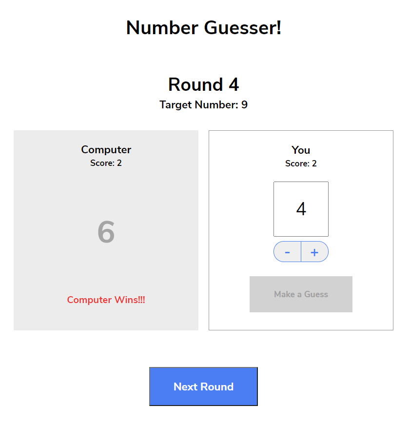
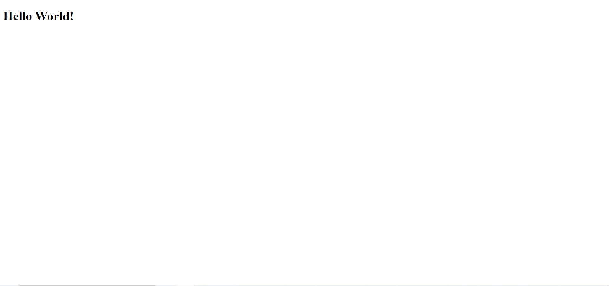

# Code academy project tutorials

> A compilation of tutorials that I have done while learning Codecademy's Full-Stack Engineer Online Course

## Table of Contents

- [General Info](#general-information)
- [Technologies Used](#technologies-used)
- [Setup](#setup)
- [Acknowledgements](#acknowledgements)

## General Information

A compilation of tutorials as follows:

1. _Number Guesser_: A simple number guesser game
2. _Credit Card Checker_: Verification of credit card numbers
3. _Mysterious Organism_: Create objects that simulate the DNA of P. aequor organism
4. _Set Up Development Environment Test_: Testing out the setting up of dev environment
5. _Mixed Messages_: A message generator program. Every time a user runs a program, they should get a new, randomised output consisting of inspirational message, a joke and  afortune telling cookie message.

## Technologies Used

- Visual Studio Code
- Javascript ES6 and earlier

## Setup

### Number Guesser

1. Download Number-Guesser folder
2. Navigate to index.html and open the file in browser
3. Play the game! Guess a number between 0 to 9

You should see this view in your browser after step 2
> 

### Credit Card Checker

1. Download Credit-Card-Checker folder
2. Test each function by removing the commented lines (Remove `/* */` enclosing the lines of codes)
3. Run main.js file using nodejs in the command prompt with the following command `node main.js`
4. You should see the outputs of each function

### Mysterious Organism

1. Download Mysterious-Organism folder
2. Test each function by removing the commented lines (Remove `/* */` enclosing the lines of codes)
3. Run main.js file using nodejs in the command prompt with the following command `node main.js`
4. You should see the outputs of each function

### Set Up Development Environment Test

1. Download Hello-World folder
2. Navigate to index.html and open the file in browser

You should see this view in your browser after step 2
> 

### Mixed Messages

1. Download Mixed-Messages folder
2. Run script.js file using nodejs in the command prompt with the following command `node script.js`
3. You should see the expected output in the following order:

```
Inspiring Message:
<Inspiring Message content>

Joke:
<Joke content>

Fortune Telling Cookie Message:
<Fortune Telling Cookie Message content>
```

## Acknowledgements

These tutorials were based on [Codecademy Full-Stack Engineer online course](https://www.codecademy.com/learn/paths/full-stack-engineer-career-path)

Thank you for viewing my random tutorials if you have read until here :relaxed:
