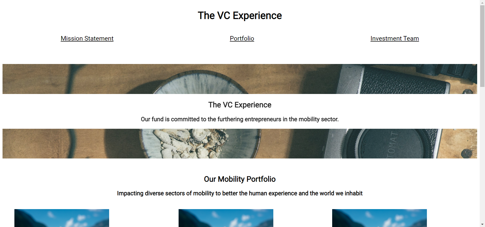

# Code academy project tutorials

> A compilation of tutorials that I have done while learning Codecademy's Full-Stack Engineer Online Course

## Table of Contents

- [General Info](#general-information)
- [Technologies Used](#technologies-used)
- [Setup](#setup)
- [Acknowledgements](#acknowledgements)

## General Information

A compilation of tutorials as follows:

1. _Number Guesser_: A simple number guesser game
2. _Credit Card Checker_: Verification of credit card numbers
3. _Mysterious Organism_: Create objects that simulate the DNA of P. aequor organism
4. _Set Up Development Environment Test_: Testing out the setting up of dev environment
5. _Mixed Messages_: A message generator program. Every time a user runs a program, they should get a new, randomised output consisting of inspirational message, a joke and  afortune telling cookie message.
6. _Dasmoto Arts_: A simple mockup website using HTML and CSS.
7. _Excursion_: Create a web page which advertises a product called “Excursion” using HTML and CSS.
8. _Build A Website Design System_: Build your own basic design system for a website.
9. _Tea Cozy_: Create a fictional tea shop website using CSS flexbox concepts.
10. _Company Home Page with Flexbox_: Build a company homepage with flexbox concepts.
11. _Find Your Hat_: An interactive terminal game.
12. _Mad Lib Functions_: Mad Libs are short stories with blank spaces, which get filled in by the user. The result is usually funny (or strange).
13. _Magic 8 Ball_: A popular toy used for fortune-telling or seeking advice.

## Technologies Used

- Visual Studio Code
- Javascript ES6 and earlier
- HTML
- CSS

## Setup

### 1. Number Guesser

1. Download Number-Guesser folder
2. Navigate to index.html and open the file in browser
3. Play the game! Guess a number between 0 to 9

You should see this view in your browser after step 2
> 

### 2. Credit Card Checker

1. Download Credit-Card-Checker folder
2. Test each function by removing the commented lines (Remove `/* */` enclosing the lines of codes)
3. Run `node main.js` in the terminal
4. You should see the outputs of each function

### 3. Mysterious Organism

1. Download Mysterious-Organism folder
2. Test each function by removing the commented lines (Remove `/* */` enclosing the lines of codes)
3. Run `node main.js` in the terminal
4. You should see the outputs of each function

### 4. Set Up Development Environment Test

1. Download Hello-World folder
2. Navigate to index.html and open the file in browser

You should see this view in your browser after step 2
> 

### 5. Mixed Messages

1. Download Mixed-Messages folder
2. Run `node script.js` in the terminal
3. You should see the expected output in the following order:

```
Inspiring Message:
<Inspiring Message content>

Joke:
<Joke content>

Fortune Telling Cookie Message:
<Fortune Telling Cookie Message content>
```

### 6. Dasmoto Arts

1. Download Dasmoto-Arts-And-Crafts folder
2. Navigate to main.html and open the file in browser
3. You should see this view in your browser after step 2

> 

### 7. Excursion

1. Download Excursion folder
2. Navigate to index.html and open the file in browser
3. You should see this view in your browser after step 2

> 

### 8. Build A Website Design System

1. Download Build-A-Website-Design-System folder
2. Navigate to index.html and open the file in browser
3. You should see this view in your browser after step 2

> 

### 9. Tea Cozy

1. Download Tea-Cozy folder
2. Navigate to index.html and open the file in browser
3. You should see this view in your browser after step 2

> 

### 10. Company Home Page with Flexbox

1. Download Company-Home-Page-with-Flexbox folder
2. Navigate to index.html and open the file in browser
3. You should see this view in your browser after step 2

> 

### 11. Find Your Hat

The scenario is that the player has lost their hat in a field full of holes, and they must navigate back to it without falling down one of the holes or stepping outside of the field..

1. Download Find-Your-Hat folder
2. Make sure you have Node and NPM installed
3. Run `npm install prompt-sync` in the terminal
4. Run `node main.js` in the terminal
5. Play the game!

>

### 12. Mad Lib Functions

1. Download Mad Lib Functions folder
2. Make sure you have PHP installed
3. Run `php index.php` in the terminal
4. You should see this view in your browser after step 3
5. Feel free to uncomment/change the codes in the echo statements to see different results.

>

### 13. Magic 8 Ball

1. Download Magic 8 Ball folder
2. Make sure you have PHP installed
3. Run `php index.php` in the terminal
4. Ask your questions away!

>

## Acknowledgements

These tutorials were based on [Codecademy](https://www.codecademy.com)

Thank you for viewing my random tutorials if you have read until here :relaxed:
